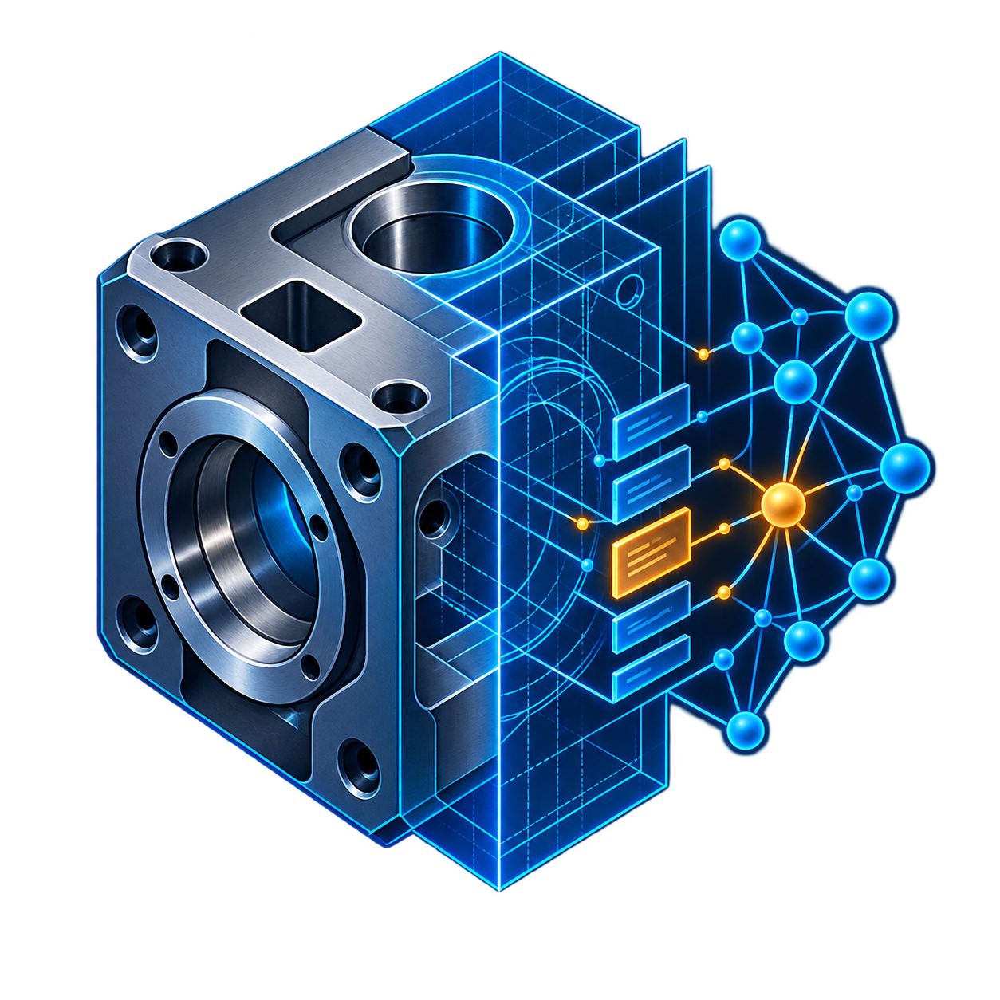
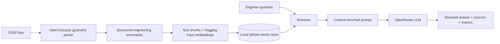

<div align="center">
  

  # STEP-RAG

  **Ask engineering questions grounded in the geometry of STEP CAD files.**

  [](https://www.python.org/)
  [](https://streamlit.io/)
  [](https://dev.opencascade.org/)
  [](LICENSE)
</div>

STEP-RAG is an engineering-focused retrieval-augmented generation prototype. It converts STEP models into structured geometric descriptions, indexes those descriptions in a local vector store, and uses retrieved CAD context to answer questions through a clean Streamlit interface.

## Why this project

General-purpose chatbots cannot inspect the geometry inside a STEP file. STEP-RAG bridges that gap by extracting useful engineering signals—such as solids, dimensions, volume, center of gravity, faces, edges, cylindrical holes, spatial relationships, and repeated geometry—before making them searchable by an LLM.

## Highlights

| Capability | What it does |
| --- | --- |
| STEP geometry extraction | Parses `.step` and `.stp` files with OpenCascade |
| Feature analysis | Describes solids, bounding boxes, volumes, faces, edges, and holes |
| Local semantic index | Stores embeddings in a disk-backed Qdrant collection |
| RAG retrieval | Supports similarity and maximal marginal relevance search |
| Engineering chat | Sends retrieved geometry context to an OpenRouter model |
| Transparent responses | Displays source files and retrieval/relevance indicators |
| Duplicate protection | Hashes processed STEP files to avoid indexing them twice |

## Architecture



The CAD files, extracted summaries, embeddings, and vector database remain on the machine. The retrieved text context and question are sent to OpenRouter for answer generation, so the current application requires internet access and an API key.

## Quick start

### 1. Clone the repository

```bash
git clone https://github.com/faheem-shah-umer/Step-RAG-chatbot.git
cd Step-RAG-chatbot
```

### 2. Create the environment

[Miniconda](https://docs.conda.io/projects/miniconda/en/latest/) or another Conda-compatible distribution is recommended because `pythonocc-core` is installed from conda-forge.

```bash
conda env create -f environment.yml
conda activate step-rag
```

### 3. Configure OpenRouter

Copy the example environment file and add your key:

```powershell
Copy-Item .env.example .env
```

```env
OPENROUTER_API_KEY=your-openrouter-api-key
```

The default configuration uses OpenRouter's free-model router. You can replace it with another supported model ID in `ask_config_openrouter.json`.

### 4. Add and index CAD files

Place one or more `.step` or `.stp` files in `data/step_files`, then run:

```bash
python Step2vstore.py
```

This creates a local vector database in `data/vector_store`. Generated summaries, the vector store, and source CAD files are intentionally excluded from Git.

### 5. Launch the interface

```bash
streamlit run app.py
```

## Example questions

- How many solids and cylindrical holes are present in this assembly?
- What are the bounding-box dimensions of the primary component?
- Which solids appear adjacent or spatially clustered?
- Are any repeated geometric patterns detected?
- What manufacturing or tolerance concerns should be reviewed for this part?

## Configuration

`config.json` controls the STEP input directory and local vector-store location. `ask_config_openrouter.json` controls the model, retrieval strategy, and engineering answer instructions. All bundled paths are relative to the repository, so the project can be moved between machines without editing user-specific paths.

To rebuild the index from scratch, remove `data/vector_store` and `step_hashes.pkl`, then run `python Step2vstore.py` again.

## Repository layout

```text
Step-RAG-chatbot/
├── app.py                       # Streamlit interface
├── Step2vstore.py               # STEP analysis and vector indexing
├── ask_chatbot_openrouter.py    # Retrieval, prompting, and response logic
├── config.json                  # Ingestion configuration
├── ask_config_openrouter.json   # Chat and retrieval configuration
├── environment.yml              # Reproducible Conda environment
├── requirements.txt             # Python dependencies
├── assets/                      # Project branding
└── data/step_files/             # Local STEP input directory
```

## Current scope

STEP-RAG is a portfolio and research prototype, not a validated metrology or production CAD system. Geometry classification and inferred component roles use heuristics; answers should be reviewed by an engineer before they influence design or manufacturing decisions.

## Roadmap

- Add automated tests with representative STEP fixtures
- Support local LLM inference for a fully offline workflow
- Add richer assembly and tolerance-analysis rules
- Export structured analysis reports
- Add side-by-side CAD visualization for retrieved geometry

## Author

Created by [Faheem Shah Umer](https://github.com/faheem-shah-umer) as an exploration of CAD intelligence, retrieval-augmented generation, and tolerance-management workflows.

## License

Released under the [MIT License](LICENSE).
